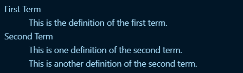

+++
author = "TYH"
title = "TYHLearning——MarkDown"
date = "2023-12-21"
description = "TYHLearning系列"
categories = [
    "TYHLearning"
]
tags = [
    "TYHLearning","MarkDown"
]
+++


## Markdown 命令使用

### Markdown [官方网址](https://markdown.com.cn/extended-syntax/automatic-url-linking.html)

### 标题语法

### Markdown 内使用 [HTML](https://www.w3school.com.cn/html/html_jianjie.asp "HTML 的学习网址") 语句

Markdown 的官方语法是可以使用下面的代码实现[定义列表](#定义列表)的（额，官方的在线编辑器也不支持 -_-），但 VSCode 预览没有效果，所以采用 HTML 格式的语法。

#### 定义列表

```markdown
<!--官方说可用代码，这里采用的是HTML的注释方法-->
First Term
: This is the definition of the first term.

Second Term
: This is one definition of the second term.
: This is another definition of the second term.
```

```html
<dl>
  <dt>First Term</dt>
  <dd>This is the definition of the first term.</dd>
  <dt>Second Term</dt>
  <dd>This is one definition of the second term. </dd>
  <dd>This is another definition of the second term.</dd>
</dl>

```

想要实现的就是这种效果


